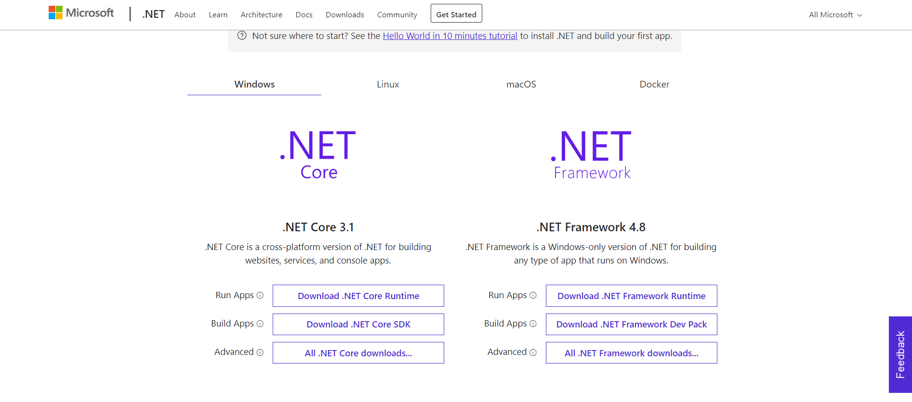
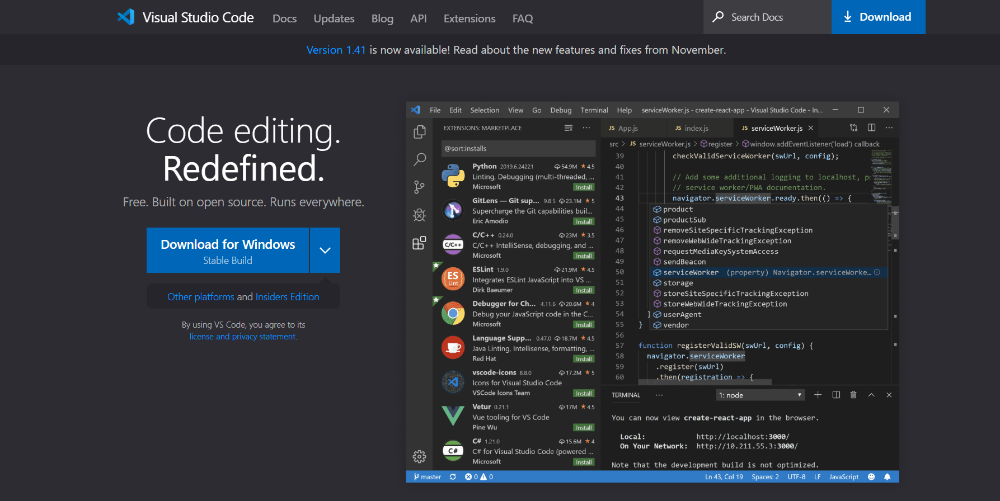
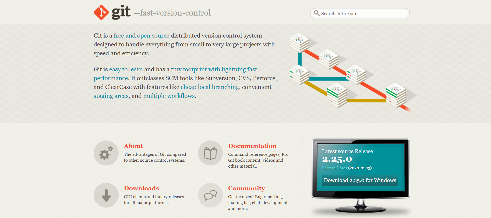
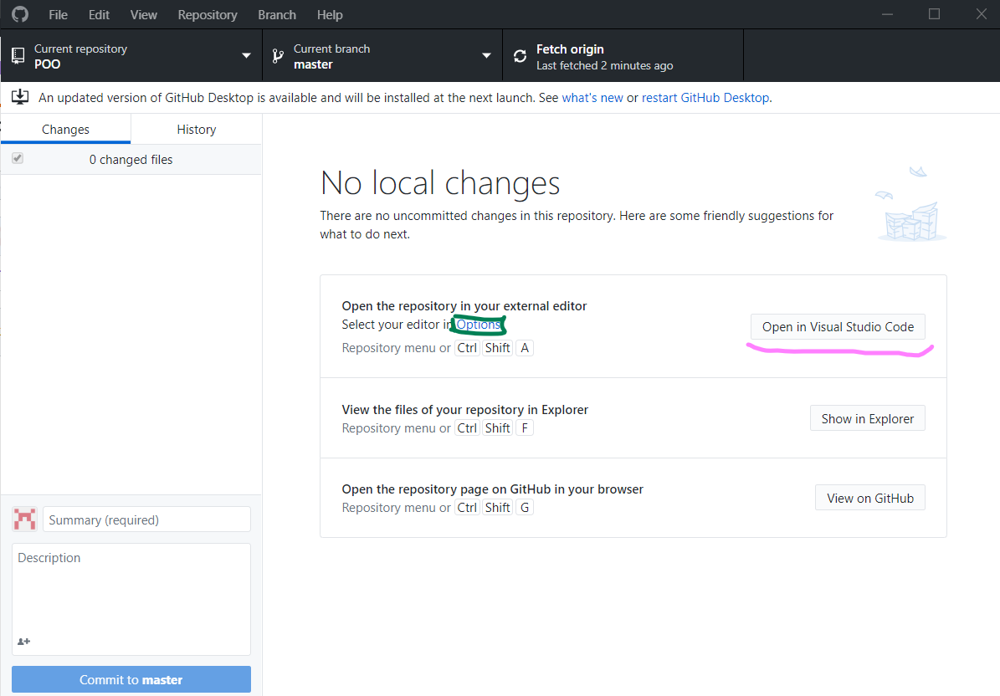
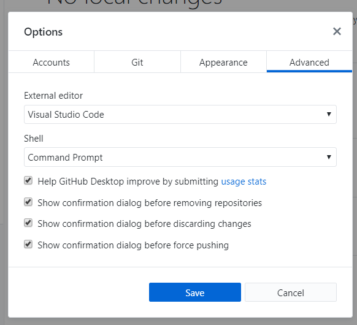

# Ejercicio de Markdown en GitHub

## Instalación de dotnet core 2.2.

El primer paso es bajar el archivo de instalacion del siguiente lugar
[(Link de la página)](https://dotnet.microsoft.com/download)

Es necesario bajar el SDK Core  **porque vamos a programar**

La página se ve asi

Buscas la version 3.1 y descargas la opcion para crear aplicaciones **Build Apps** . Despues de descargarlo es sencillo, solo abres el archivo y aceptas los terminos para instalarlo... En unos cuantos minutos estara listo para utilizarse.

## Instalación y configuración de Visual Studio Code para C#.

Para descargar Visual Studio Code solo entra a este link
[(Link de la página)](https://code.visualstudio.com/) . Aqui solo debes seleccionar tu sistema operativo y de cuantos bits deseas descargarlo, te recomiendo que descargues la version normal **Stable Build** ya que **Insiders** es para desarrolladores y te puedes encontrar con mas bugs.
Despues de descargarlo, debes aceptar los terminos y buscar el lenguaje en el que deseas programar, en mi caso utilizare **C#**.

## Instalación de git. conectado a tu cuenta de GitHub y VSC.

Para utilizar GitHub y sus derivados, primero instalaremos **Git Bash** (64 bit) [(Link de la página)](https://git-scm.com/) Aqui solo debo recomendarte que en las opciones al instalarlo cambies a **3rd party software** y las demas opciones aceptarlas como se muestran predertminadas.

Despues de instalar git ahora vamos a descargar **GitHub Desktop** en este link [(Link de la página)](https://desktop.github.com/) lo cual va a ser muy sencillo, al instalarlo solo inicias sesión con tu cuenta de GitHub y al entrar te va a mostrar todos tus repositores los cuales puedes descargar para seguir modificandolos directo desde tu pc, para ello va a ser necesario elegir **Visual Studio Code** como predeterminado para abrir tus archivos.

Esto se puede poner desde esta parte, si no esta ya seleccionado Visual Studio Code como se muestra en azul, entra a opciones en la opcion encerrada en rojo.

Despues de entrar a **Options** aparecera este menu, seleccionas la opcion **Advanced** como en la imagen y en donde dice **External Editor** solo debes buscar **Visual Studio Code** y lo seleccionas.

